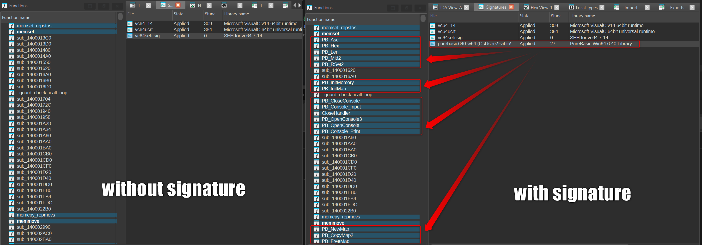

# PureBasic FLIRT Signatures for Hex-Rays IDA — Demonstration

What an [Hex/Rays IDA](https://hex-rays.com/ida-pro/) FLIRT signature does to a binary compiled with **PureBasic** (Windows, PE x86/x64): it lets the disassembler recognize and label the statically-linked runtime functions automatically, so the author's own code stops being lost in a sea of anonymous library routines.

This repo is a **demonstration**, built around a small crackme I wrote and compiled myself. It is not a guide to generating the signature.

## Why?

When you load a PureBasic-compiled executable into IDA, every runtime library routine shows up as an anonymous `sub_XXXXXX`. The entire PureBasic runtime is statically linked into the binary, so you scroll through dozens of these just to find the handful of functions the author actually wrote — and those functions are themselves built out of calls into the unnamed runtime.

[FLIRT](https://docs.hex-rays.com/core/flirt) (Fast Library Identification and Recognition Technology) is what fixes this. It is the same mechanism IDA already ships for the Visual C++, Delphi, and Go runtimes. Once a PureBasic signature is applied, the runtime functions get named and the author's code becomes legible.

## What's in here

- A walkthrough [reversing-purebasic-crackme.md](reversing-purebasic-crackme.md) reversing the included crackme in IDA, showing the Functions window and the key routine **before** and **after** a PureBasic signature is applied.
- The crackme source, so you can compile it and reproduce the analysis on a binary that is entirely your own.

## What's *not* in here, and why

**No `.sig` file, and no signature-generation procedure.**

The PureBasic runtime libraries are copyrighted by Fantaisie Software, and they ship in a consolidated, non-standard format rather than the plain static archives the Hex-Rays FLAIR tools expect. Documenting how to take that format apart would amount to reverse-engineering their proprietary packaging, which their license is protective about — so it is deliberately left out.

Whether a ready-made signature can be shared publicly is a question I've put to Fantaisie Software directly. Until there's an answer, this repo sticks to what's unambiguously fine: analyzing my own compiled binary and demonstrating the effect of a signature.

## Reproduce the analysis

1. Compile `crackme.pb` with [PureBasic](https://www.purebasic.com) for Windows.
2. Load the resulting `.exe` into IDA and let auto-analysis finish.
3. Open the Functions window — observe the wall of `sub_XXXXXX`.
4. (With a PureBasic signature applied) re-open the Functions window and watch the runtime get named, leaving your `ComputeSerial` routine as the obvious odd one out.

The walkthrough shows what steps 3 and 4 look like in practice.

## License

The write-up and the crackme source in this repository are released under the MIT License. The PureBasic runtime libraries are © Fantaisie Software and are **not** included or redistributed here.
